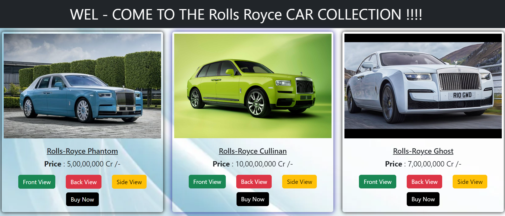

# Car_Collection 🚗

### Description:-

#### Curated Car Collections 🚔Browse Now!

Car-Collection is your online destination for exploring a curated selection of exquisite automobiles from classic to contemporary,
offering enthusiasts a virtual showroom of automotive excellence

# Our Project Images

# Most Searched Car

# Price Collection

### Our Team

## Summarize
Car Collection is an online marketplace for buying and selling high-end luxury vehicles. The website features an extensive inventory of exclusive and rare automobiles from around the world. Each vehicle listing includes detailed information, high-quality images and a verified history report. Car Collection offers a personalized buying experience with a team of expert advisors available to assist with financing, shipping and any other needs you may have. Whether you are a collector or simply looking for a rare and exceptional automobile, Car Collection is the ultimate destination for luxury car enthusiasts.

# Contribute:-

